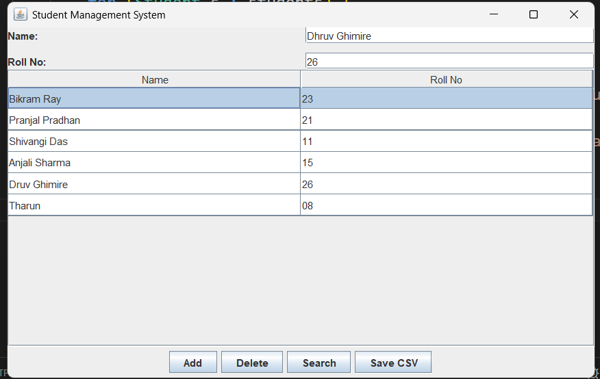

# Student Management System (Java GUI)

## Description
This is a desktop application built using Java Swing to manage student records.

## Features
- Add student
- Delete student
- Search student by Roll Number
- Display records in table
- Save data to CSV

## Tech Used
- Java
- Swing
- ArrayList
- File Handling

## How to Run
1. Compile:
   javac StudentManagementGUI.java

2. Run:
   java StudentManagementGUI

## Output

## Author
Bikram Ray
